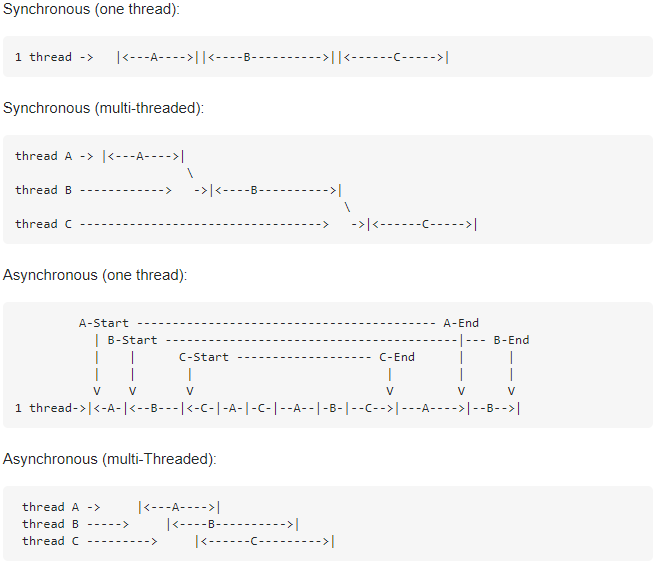

# Programming Concepts

### 3.1 Object vs Class

Class is meant as a template / blueprint from which objects are created.

Classes are compiled with the code, and such, do not alocate memory dynamically. (Logical existence)  
Object does dynamically alocate memory due to teardown and creations of certain objects during the lifecycle of the program. (Physical existence)

### 3.2 Global Variables

With global variables it's hard to control state, as every class and method in the program has access to this variable.  
It also gives a better readability and fast understanding, for the developer, as it's posible to follow the state from start till end, if you leave the global variables out.

### 3.3 Thread Safe

Thread safety means to not have multiple threads accessing the same variable at the same time. 2 thread might try to set a variable at the same time, which could cause a race condition. These timings issues are hard to find and easy to make, if thread safety is not implemented.

Thread safety can be accomplised by, among others, using the keyword synchronized (java), using a mutex (c++, possible others) or using atomics (java)

### 3.4 Encapsulation

Encapsulation is the concept of hiding data / variables inside classes, accessing these data through public setter / getter methods on the class that holds the data.

### 3.5 Asynchronous vs. synchronous programming

Asynchronous code makes it possible to run multiple computational tasks at the same time.  
I believe the best way to illustrate this, is by using a picture from StackOverflow.  

### 3.6 Transaction concept

