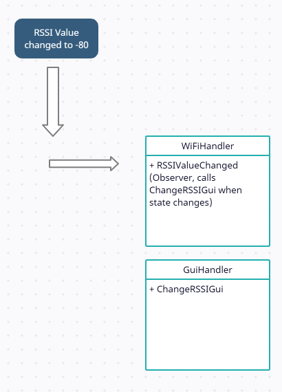
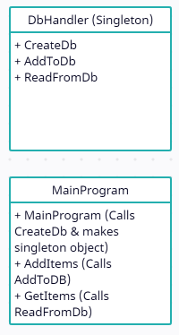

# Programming patterns

### Observer pattern
The observer pattern has it's basis in getting a notification or a state change and calling the correct methods based on the change. The observer can be set to only observe a specific notification or a set of notifications.

I have tried to illustrate the notification of an RSSI value changing, when moving around with a wifi connected product. When the RSSI value changes, we need to change the wifi icon, so the user can see, that they are on the way out of range. Due to this, we need an observer that can see the notification and call the correct methods when needed.

### Singleton pattern
The singleton pattern insures that only one instance is to be made of a class.

I've illustrated the used of a singleton, below. Having the use of a singleton would make it safer, if you had to use a file database, for example. The file database can only be accessed by 1 "user" at a time, so using the singleton would be the best solution.

If I were to make a solution with this usecase in mind (database), I would make it as a context manager, so that we also could go for the TDD method, when making the class that handles the database.

