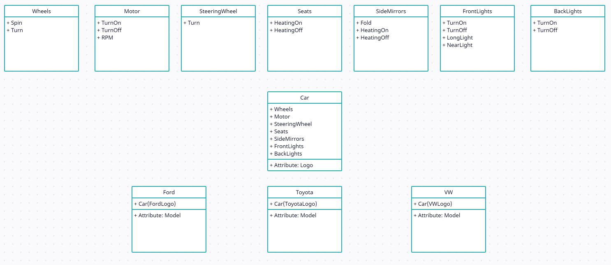
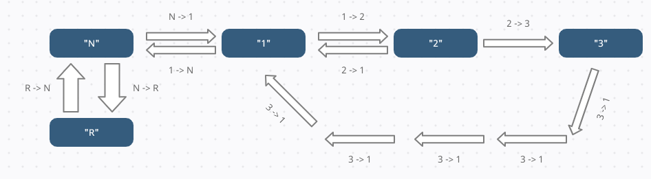
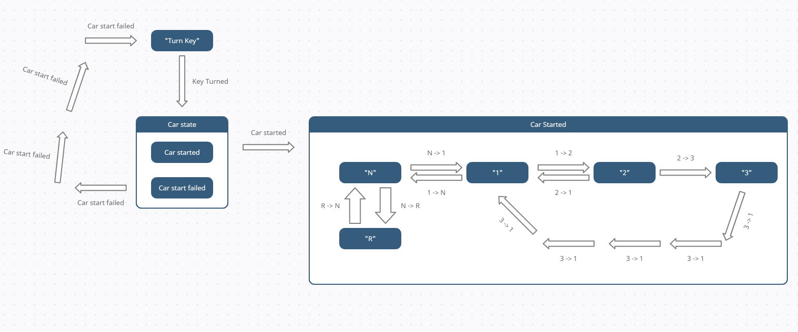

# UML Design & Analysis

### UML Class diagram
As seen below, we have all the parts as classes, these could also just be attributes og the car class, but doing it this way, we make sure that every car has the basis parts for it to run. The next challenge would then be to differentiate between a 1.6 liter engine and a 2.0 liter engine (for example).

### UML State diagram
Below is the state diagram of the assignement described in the mail.
Assignment: 
The car always starts in "N" (neutral).  
From "N", it can shift up to "1" or down to "R" (reverse).  
From "R", it can only shift up to "N".  
From "1", it can shift up to "2" or down to "N".  
From "2", it can shift shift up to "3" or down to "1".  
From "3", it can shift down to "1"  

### Extend UML State diagram
If the car failes to start, we have to turn the key again, this can be done n amount of times, untill the car starts. When the car starts, we can begind shifting gears.

